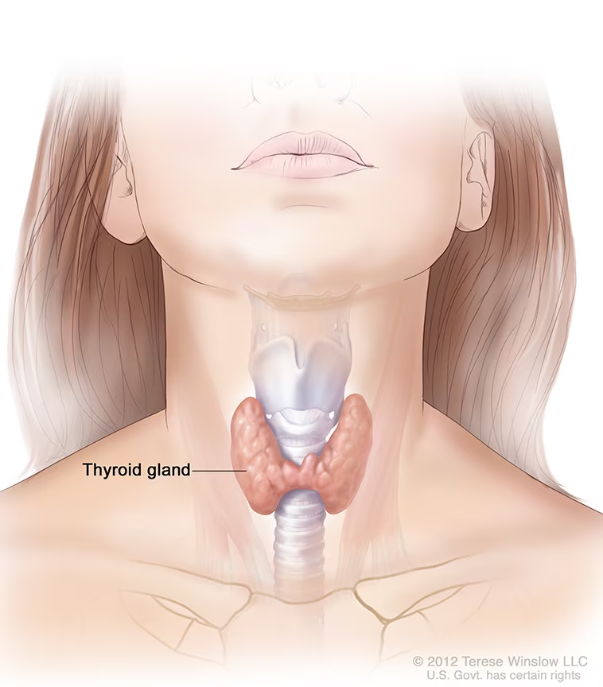

# Hypothyroid Disease Detection using Decision Tree Classifier

Hypothyroidism, also called underactive thyroid, is when the thyroid gland doesn’t make enough thyroid hormones to meet your body’s needs. The thyroid is a small, butterfly-shaped gland in the front of your neck. Thyroid hormones control the way your body uses energy, so they affect nearly every organ in your body, even the way your heart beats. Without enough thyroid hormones, many of your body’s functions slow down.

Dataset link:https://archive.ics.uci.edu/dataset/102/thyroid+disease

* Additional Information

* Thyroid disease records supplied by the Garavan Institute and J. Ross Quinlan, New South Wales Institute, Syndney, Australia.
* 6 databases from the Garavan Institute in Sydney, Australia
* 2800 training (data) instances and 972 test instances 
* Plenty of missing data 
* 29 or so attributes, either Boolean or continuously-valued
